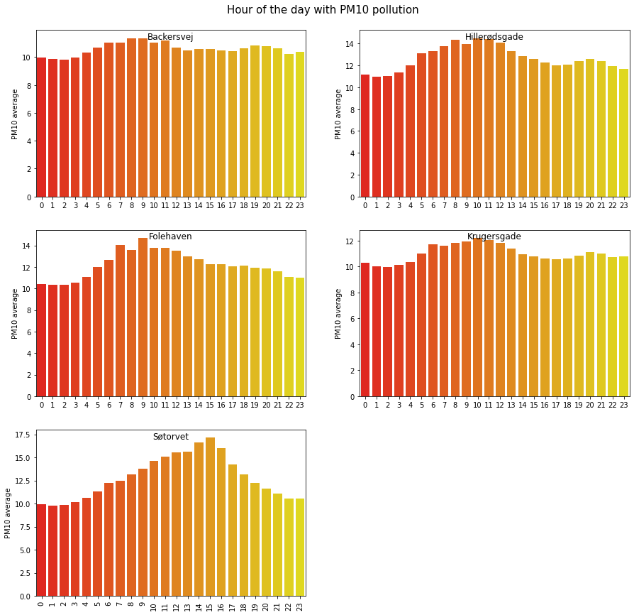

Air pollution, also known as the silent killer, is well documented to have a negative impact on human health. Furthermore, air pollution can be incredibly difficult to detect when, where, and what the exposure is, and even though we do not feel the exposure, it can be fatal for our health. To put into perspective, around 460 people die from air pollution every year in Copenhagen. That accounts for every 10th person who dies (https://erluftensund.kk.dk/viden-om/fakta-om-luftforurening-og-sundhed).

This article will explore the air pollution in Copenhagen to give the citizens of Copenhagen an extra dimension when considering which area to spend time in. Through knowledge sharing, the authors believe they can support SDG 3; to secure healthy lives and promote well-being for all of all ages. Specifically, they aim to reduce deaths and illnesses from air pollution. This article will focus on the pollution of pm2.5, pm10, and NO2 as they are the most common measurements in Denmark.
## Displaying the data as a time series

The pollution in Copenhagen shows quite stable particle levels in the last year but with spikes in especially March 2022. Looking at the figure it can seem quite harmless, but do not be fooled, because the spikes above 40 in pm2.5 and pm10 reveal that it was unhealthy to be outside those days.   

#### Figure 1 - plot of NO2

#### Figure 2 - plot of pm10

#### Figure 3 - plot of pm2-5


So, let's have a look at how you can prevent exposure your body to unhealthy pollution. There are a few tips you can follow to minimize the exposure to your body as there are some clear patterns when the exposure is happening.
#### Figure 4 - weekly 

## Going for a run?

Then you should definitely do it on the weekend. As seen above the pollution is much lower on weekends compared to the weekend. This is due to less traffic as people often stay home and construction projects are on pause.
#### Figure 5 - daily

Looking at the daily pattern we see a clear peak when people rush to and from work. You should avoid going for a run during these hours, and maybe see if you can fit your running routine in, during the work hours. People that think the best time to run is 06 in the morning, can think again!

<iframe src="/heatmap.html"
	sandbox="allow-same-origin allow-scripts"
	width="100%"
	height="500"
	scrolling="no"
	seamless="seamless"
	frameborder="0">
</iframe>

So where is it you are not supposed to run?

5 different locations in Copenhagen take hourly measures of pollution every day. In figure 5 an illustration has been made to show where and which days the pollution level was unhealthy in March 2022. Note – the points will be red the entire day if the pollution, at some point during the day, was unhealthy.

## Still not convinced?

Explore it for yourself! Below you can compare the areas and particle levels to each other in this fun interactive tool.
#### Figure 7 - bokeh
 

